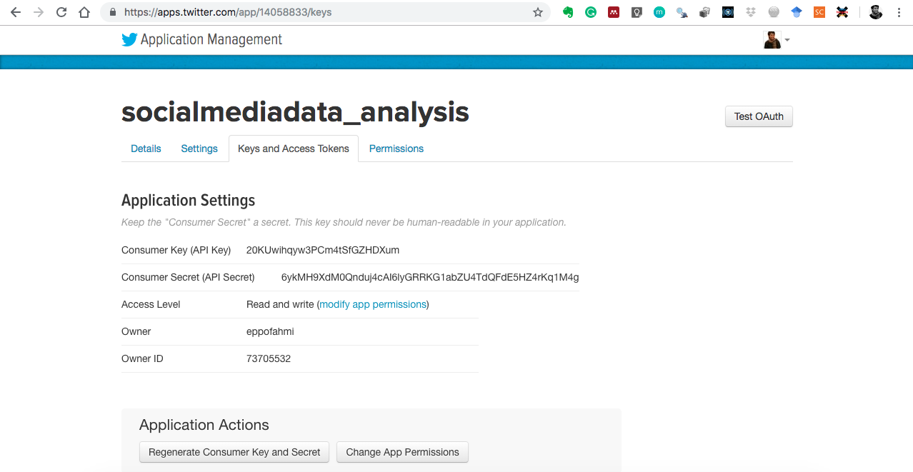

# Latihan

Dalam latihan kali ini terdapat dua hal utama yang akan kita coba. Pertama, mendapatkan data. Kedua, mengeksplorasi data. Data yang akan coba didapatkan berupa twit dengan memanfaatkan API basic. Menggunakan API basic tersebut kita bisa mendapatkan tweet sejauh 7 hari ke belakang dengan jumlah paling banyak sekitar 40 ribu. 

## Mendapatkan data
Untuk mendapatkan data dari Twitter kita bisa menggunakan dua cara. Pertama dengan menggunakan API. Kedua dengan melakukan scrapping. Pada kesempatan ini kita akan lebih dahulu mencoba mendapatkan data dengan menggunakan API basik. Untuk bisa menggunakan API basic kita harus terlebih dahulu mendaftar di: https://apps.twitter.com/. Setelah mendafatar dengan mengikuti prosedurnya, masuklah pada aplikasi yang telah anda dan dapatkan `api key`, `api secret`, `access token` dan `Access Token Secret` pada bagian `Keys and Access Token` seperti tampak pada gambar berikut. 

<div class="figure">

<p class="caption">(\#fig:intro1)Keys and Access Token Twitter.</p>
</div>

Selanjutnya, anda bisa menggunakan script dibawah ini untuk mengatur penggunaan API dalam R dengan menggunakan library `twitteR`. Untuk itu langkah-langkah yang diperlukan adalah:

1. Memanggil library


```r
library(twitteR)
```

2. Setting API


```r
api_key <- "20KUwihqyw3PCm4tSfGZHDXum"
api_secret <- "6ykMH9XdM0Qnduj4cAI6lyGRRKG1abZU4TdQFdE5HZ4rKq1M4g"
token <- "73705532-WlCKXW7Cjd2U2fcSUflTOnoLE0Nrk26gy6xddFzeM"
token_secret <- "JrUQjxTSx3QSTAGQnL1lnsO2ua8g4LKDV6xzZ4iJW3Rwh"
```

3. Setting permission access


```r
setup_twitter_oauth(api_key, api_secret, token, token_secret)
```

Ketika anda menjalankan script di atas pada bagian `console` akan ada perintah untuk mengonfirmasi. `Tekan 1 dan enter untuk menlanjutkan`. 

4. Proses ambil data

Dalam proses ini kita membutuhkan akses internet yang akan menentukan lama atau cepatnya pengambilan data. Di dalam librar `twitteR` terdapat beberapa fungsi yang bisa digunakan untuk mengumpulkan data seperti untuk mendapatkan teks/twit yang berasal dari letak geografis dan jam tertentu atau untuk mendapatkan timeline sebuah nama akun (username). Pada kesempatan ini kita akan menggunakan fungsi `searchTwitter` untuk mendapatkan twit sebanyak 1000 (`n = 1000`) dengan kata kunci tagar **#bubarkanbanser**. 


```r
banser <- searchTwitter("#bubarkanbanser", n = 1000) # collect tweets
banser <- twListToDF(banser) # mengubah format data menjadi data frame
write.csv(banser, "contoh_data.csv") # menyimpan data
```

Data yang didapat berupa list, untuk itu pada script bari kedua kita akan mengubahnya menjaid data frame agar lebih mudah dieksplorasi. Selanjutnya data yang didapat kita simpan dalam directory yang sudah kita tentukan sebelumnya saat membuat `project`. 

## Eksplorasi data

Di dalam proses mengeksporasi data, hal pertama yang harus diketahui adalah datanya itu sendiri. Misalnya berapa jumlah observasi, variabel, jenis variabel dan lain sebagainya. Pada konteks data yang kita dapatkan dengan metode di atas, terdapat 1000 observasi dan 16 variabel, seperti dapat dilihat pada bagian `Environment` (sebelah kanan atas). Untuk mendapatkan tilikan dengan cepat kita bisa menggunakan fungsi `summary` seperti berikut. 


```r
summary(banser)
```

Fungsi di atas akan memberikan rangkuman semua variabel atau kolom yang ada. Di mana dengan melihat rangkuman tersebut di antarnya kita akan segera mengetahui kapan twit pertama dan terakhir di kirim dalam data. Selain itu, kita juga bisa mengetahui jenis data pada masing-masing kolom serta beberapa statistik dasar. Sehingga berdasarkan rangkuman tersebut kita bisa memutuskan untuk dapat menentukan hal apa yang akan di eksplorasi terlebih dahulu. 

Dengan menggunakan materi sebelumnya (lihat Chapter \@ref(explorasi1)), kita selanjutnya dapat mengeksplorasi akun paling banyak disebut, tagar paling sering digunakan dan kata paling banyak ditulis kolom text. Di mana dalam kolom tersebut selain teks twit juga terdapat nama akun yang disebut oleh pengirimnya, tagar, dan konten lainnya.
