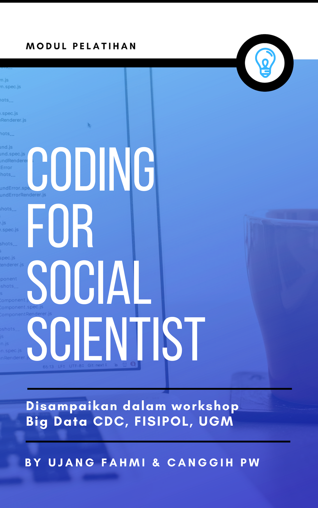

--- 
title: "Coding for Social Scientist"
subtitle: "Disampaikan dalam Workshop *Big Data* yang diselenggarakan oleh CDC, FISIPOL, UGM, 2018"
author: "Ujang Fahmi and Canggih Puspo Wibowo"
date: "2018-10-31"
site: bookdown::bookdown_site
output: bookdown::gitbook
documentclass: book
bibliography: [book.bib, packages.bib]
biblio-style: apalike
always_allow_html: yes
link-citations: yes
colorlinks: true
github-repo: eppofahmi/belajaR
cover-image: images/cover.png
description: "Modul pelatihan pengolahan big data yang diselenggarakan oleh CDC Fisipol, UGM, pada 31 Oktober 2018."
---

# Selamat Datang {-}

# Pengantar {-}

Saat ini sumber data yang dapat digunakan baik untuk tujuan penelitian maupun bisnis banyak tersedia di internet. Sayangnya, tidak semua orang bisa memanfaatkannya. Terdapat beberapa kendala mengapa tidak semua orang bisa mengekstrak pengetahuan dari sumber data yang cenderung lebih murah dan sebenarnya mudah untuk di dapatkan tersebut. Salah satu sebab utamanya kurangnya keterampilan untuk membuat alat untuk mengambilnya. Dalam konteks ini adalah keterampilan untuk memanfaatkan open source, salah satunya adalah R. 

R merupakan salah satu open source yang saat ini cukup populer dan banyak digunakan oleh berbagai organisasi dengan skala besar hingga kecil. Pengguna R tersebar mulai dari perusahaan seperti Google dan Facebook, pemerintahan, hingga usaha kecil menengah. Berdasarkan definisi di laman resminya, R merupakan bahasa pemrograman untuk mengolah data secara statistik. Dalam praktinya R juga banyak digunakan untuk mengolah data tidak terstruktur, termasuk data dari media sosial. 

Sayangnya, *coding* diidentikan hanya dilakukan oleh anak teknik. Hanya sedikit akademisi sosial yang memiliki kemampuan tersebut. Padahal, akademisi sosial memiliki salah satu modal utama untuk bisa membuat data menjadi lebih berarti, yaitu *domain knowledge*. Sebaliknya, hanya sedikit yang bisa *coding* memiliki *domain knowledge* untuk bisa memanfaatkan informasi yang diekstrak dari data dalam jumlah banyak. Dalam konteks ini, kolaborasi lintas disiplin ilmu dapat menjadi salah satu solusi. Tapi, masing-masing pihak minimal memiliki pengetahuan dan pemahaman dasar tentang cara kerja masing-masing. Selain itu, akademisi sosial juga bisa belajar sendiri dengan memanfaatkan berbagai sumber baik yang gratis maupun berbayar yang saat ini banyak tersedia di Interent. 

Melalui workshop ini, kami bertujuan untuk mengenalkan beberapa dasar pengelolaan big data dengan menggunakan bahasa pemrograman R. Setelah mengikuti workhshop, peserta diharapkan memiliki: 

1. Pengetahuan tentang bahasa pemrograman;
2. Pemahaman alur pengolahan big data; dan
3. Kemampuan untuk membuat skrip/menjalankan skrip untuk mendapatkan data dari internet

Workshop ini terdiri dari tiga kegiatan. *Pertama*, penjelasan tentang R dan Rstudio. *Kedua*, memahami proses ekstraksi informasi dari big data. *Ketiga*, praktik mendapatkan dan mengeksplorasi data dari twitter.

