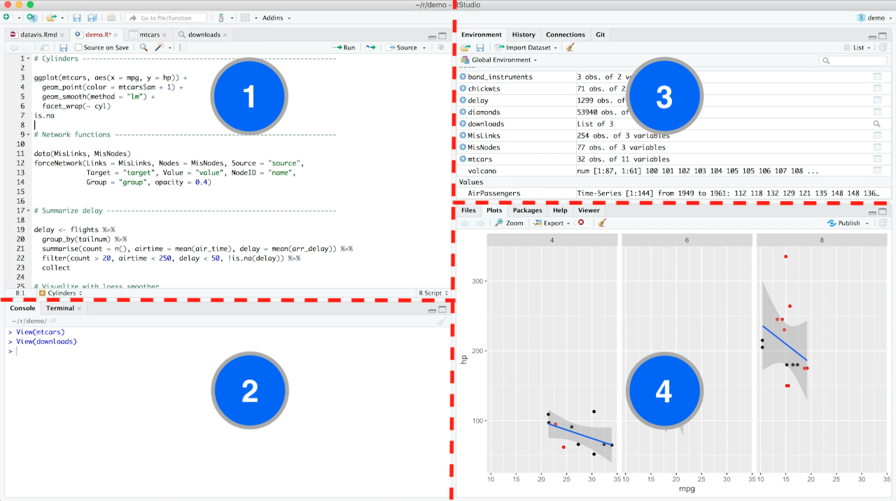
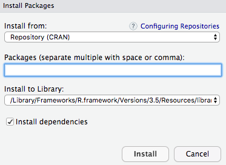

# Pengenalan dasar
Sebelum melangkah lebih jauh, mungkin kita terlebih dahulu perlu mengetahui apa itu bahasa pemrograman? apakah ia merupakan bahasa yang berfungsi sama dengan bahasa yang kita gunakan sehari-hari? Menurut [Wikipedia](https://en.wikipedia.org/wiki/Programming_language), bahasa pemrograman adalah: 

> ... a formal language, which comprises a set of instructions used to produce various kinds of output. Programming languages are used to create programs that implement specific algorithms.

Berdasarkan definisi di atas, maka fungsi bahasa pemrograman kurang lebih sama dengan bahasa yang kita gunakan sehari-hari dalam membuat buku petunjuk atau resep masakan. Perbedaannya, bahasa yang kita gunakan ditujukan agar dapat dipahami oleh manusia, sedangkan bahasa pemrograman agar dapat dipahami oleh komputer, di mana `R` merupakan salah satu di antara bahasa pemrograman yang saat ini ada dan berkembang dengan pesat. 

Sementara `Rstudio` adalah alat untuk mempermudah penggunaan `R`. Di sini `RStudio` sering disebut sebagai *integrated development environment* (IDE) untuk R. Sederhananya, RStudio digunakan sebagai tampilan dari R. Oleh karena itu, untuk menggunakannya pun kita terlebih dahulu harus menginstall `R`. Gambar `1.1` menunjukkan tampilan antar muka `Rstudio` yang perlu diperhatikan.

<div class="figure">

<p class="caption">(\#fig:intro1)RStudio Interface terdiri empat bagian utama.</p>
</div>

Seperti dapat dilihat pada gambar `1.1`. Rstudio memiliki empat bagian yang memiliki fungsi masing-masing. Bagian pertama (1): digunakan untuk menulis script dan memiliki beberapa tombol. Untuk menjalankan script bisa klik run pada bagian kanan atas. Bagian kedua (2) : merupakan bagian `console` di mana kita bisa melihat script yang dijalankan. Bagian ketiga (3): merupakan bagian environment, dimana pada bagian tersebut terdapat beberapa bagian yang bisa pilih. Misalnya, bagian `Environment` untuk menampilkan data yang dimasukkan (diimport), bagian `Hystory` untuk melihat aktivitas yang sudah dilakukan dalam satu sesi R, dan bagian `Connection` untuk melihat dan mengatur koneksi R dengan database seperti `SQL` atau `SPARK`. 

Bagian terakhir (4): berfungsi untuk menampilkan hasil visualiasi (`plot`). Selain itu, pada bagian ini kita juga bisa melihat repository dan file-file yang ada di dalamnya. Lebih penting lagi, di sini kita juga dapat menemukan bantuan ketika kita lupa instruksi yang dibutuhkan. Untuk menemukan bantun atau penjelasan kita dapat menggunakan fungsi `?` diikuti dengan objek yang ingin dilihat. Contohnya adalah sebagai berikut. 


```r
?read.csv
```

Dengan menuliskan code di atas pada bagian `console` dan menekan `Enter` pada bagian 4 akan menampilkan hasilnya. Di mana pada tampilan tersebuk kita bisa mendapatkan definisi fungsi sekaligus contoh penggunaannya. Selain itu, anda juga perlu mencoba untuk menggunakan fungsi bantuan lainnya, yaitu `help()` pada console dan lihat apa yang dihasilkan.

Sebagai rangkuman, pada bagian ini kita sudah mengetahui dan mengenal beberapa bagian. Pertama untuk menggunakan `RStudio` kita terlebih dahulu perlu menginstall `R`. Untuk mendapatkan bantuan penjelasan kita bisa menggunakan fungsi `help()` atau `?` diikuti objek yang ingin dilihat. Rstudi terdiri dari beberapa. Untuk ini saya sarankan untuk mengeksplorasinya lebih jauh, karena pada bagian selanjutnya kita akan mulai belajar untuk menulis dan menjalankan script.

## Menyiapkan R

Agar dapat menggunakan R secara lokal atau PC/laptop masing-masing, kita perlu mengunduh installernya terlebih dahulu di laman berikut: 

1. Dari Indonesia, R bisa didapat secara gratis di laman: https://repo.bppt.go.id/cran/
2. Rstudio dapat didownload melalui laman: https://www.rstudio.com/products/rstudio/download/#download

Kita bisa menyesuaikan file installer yang sesuai dengan machine laptop/PC masing, misalnya untuk `MAC`, `WINDOWS` atau `LINUX`. Setelah dua file tersebut terunduh silahkan install `R` terlebih dahulu kemudian `RStudio`. Setelah keduanya berhasil di install saat ini mesin pc/latop, jalankan Rstudio. Selanjutnya coba tuliskan script dibawah ini pada bagian `console` lalu tekan `enter`. 


```r
?help
?base
```

Script di atas akan mengarahkan anda pada sebuah halaman baru yang berisi keterangan tentang package dasar [@R-base] pada bagian kolom 1 dan keterangan fungsi-fungsi dasar pada kolom 4. Pada bagian kolom 4 ada tulisan `[Package base version 3.5.1 Index]`, klik bagian `index` yang berwarna biru dan anda akan diarahkan pada dokumentasi fungsi-fungsi dasar R. Klik salah satu fungsi untuk membaca penjelasn dan melihat contoh penggunaannya.

### Install Package

Seperti telah dijelaskan dalam pengantar, pengolahan data dengan R didukung oleh berbagaik packages atau library yang dokumentasinya dapat dilihat di laman ini: https://cran.r-project.org/web/packages/available_packages_by_name.html. Untuk dapat menggunakannya anda perlu menginstallnya terlebih dahulu. Hal ini bisa dilakukan dengan menggunakan salah satu fungsi dasar R, yaitu `install.packages()`, di dalam kurung di isi dengan nama package/library. Misalnya, nama package yang akan diinstall adalah `tidyverse` [@R-tidyverse], maka pada bagian `console` kita bisa menuliskan script berikut lalu klik enter. 


```r
install.packages("tidyverse")
```

Agar dapat menginstall package, pc/laptop kita harus terhubung dengan internet karena R akan mendownload dari laman `CRAN` di atas. Selam proses menginstall sebaiknya kita tidak menyimpan script apapun. Barus setelah selasai menginstall kita bisa melanjutkan aktivitas di RStudio. Kita dapat mengetahui instalasi sudah selese dengan memperhatikan bagian console yang akan mengeprint aktivitas yang sedang berlangsung. Selain itu, pada bagian `console` sebelah kanan atas juga ada tanda merah jika masih ada proses yang berlangsung. 

Selain dengan menggunakan fungsing `install.packages()`, packaages atau library juga diinstall dengan menggunakan fitur yang sematkan di RStudi, yaitu fitur `Tools`. Fitur `Tools` terletak dibagian atas antar muka, dan kita hanya perlu memilih menu `install packages` yang ada di dalamnya dan akan muncul kota dialog baru seperti di terlihat pada gambar berikut.

<div class="figure">

<p class="caption">(\#fig:intro5)RStudio Interface terdiri empat bagian utama.</p>
</div>

Dialog box seperti pada gambar 1.2 menunjukkan ada tiga isian yang perlu diperhatikan. Pertama, bagian sumber. Secara *default* sumber package yang akan diinstall diambil dari CRAN. Kedua, kolom nama package yang harus diisi secara manual (ketik). Ketiga, kolom yang menunjukkan *repository* atau folder tempat package akan diinstall. Keemapat, dependency yang ketika dicentang berarti kita akan menginstal package atau library lain yang dibutuhkan oleh package yang akan diinstall. Untuk sementara, dua kolom yang disebut terakhir disarankan untuk biarkan pengaturan semula atau *default*.

### Latihan 1

> Untuk mengelola teks, terdapat salah satu library dengan nama `tidytext`. Installah library tersebut dengan salah satu metode install package yang sudah dijelaskan. 

### Simbol-simbol utama

Secara lengkapnya, simbol dan fungsi-fungsi dasar dapat dipelajari [di sini](https://www.rstudio.com/wp-content/uploads/2016/05/base-r.pdf). Namun pada umumnya, dalam `R` ada dua simbol utama yang sering digunakan yaitu `"xyz"` (tanda petik) dan `#` (tanda pagar). 

1. Tanda petik (`"xyz"`) digunakan untuk menunjukkan bahwa apapun yang ada diantara dua tanda petik tersebut dianggap sebagai character (`chr`). Sebagai contoh, jalankan script di bawah ini.


```r
# vector
huruf_a <- "1"
# cek apakah karakter atau bukan
is.character(huruf_a)
```

```
## [1] TRUE
```

```r
# vector
huruf_b <- 1
# cek apakah karakter atau bukan
is.character(huruf_b)
```

```
## [1] FALSE
```

2. Tanda pagar (`#`) digunakan untuk memberikan komentar yang berfungsi untuk memberikan keterangan terhadap script yang kita buat. Sebagai contoh, pada script di atas term vector yang didahului oleh tanda pagar saya gunakan untuk mengingat bahwa kode yang ada dibahwanya merupakan sebuah vector. Sementara komentar berikutnya saya gunakan untuk memberikan keterangan bahwa kode yang ada dibawahnya digunkan untuk mengecek apakah benar `huruf_a` dan `huruf_b` merupakan karakter. 

3. Tanda `<-` atau `=` dibaca sama dengan. 

## Membuat skrip R

Dengan menggunakan `RStudio` kita bisa membuat beberja jenis script untuk menuliskan bahasa R. Untuk sementara saya hanya akan mengenalkan dua jenis dulu, yaitu `.R`. Caranya adalah dengan klik menu `File` -> `New file` -> `R Script` atau `Command+Shift+N` jika menggunakan Macbook. Sama seperti saat kita menulis atau membuat file pada umumnya, pada saat menulis script R untuk mengorganisasinya dengan mudah kita perlu meletakannya dalam sebuah folder atau *repository* khusus. Di dalam RStudio, kita bisa membuatnya dengan memilih `New Project...` pada menu file, lalu pilih `New Directory` dan pilih `New Project`. Setelah itu, kita bisa menentukan hardisk yang akan digunakan untuk menyimpan file *project* yang sedang dikerjakan, menamai folder, dan lain sebagainya. Dengan cara seperti itu, pekerjaan kita bisa menjadi lebih terorganisasi. 


```r
# Untuk memastikan di mana kita menyimpan file atau project
getwd()
```

### Latihan 2

> Buatlah sebuah proyek baru dengan nama yang anda pilih sendiri. Setelah itu, buat sebuah R script dan simpan dalam project tersebut. 

### Menulis skrip

Untuk memulai menulis skrip, terdapat dua hal pertama yang ingin saya anggap sebagai dasar, yaitu cara membuat variabel dan mengenal jenis data. Terkait dengan jenis data, terdapat beberapa data yang bisa digunakan seperti vector, data frame, lists, dan matrix. Di sini kita akan lebih fokus ke vector dan data frame saja. Namun jika tertarik untuk mempelajarinya lebih lanjut bisa memulainya [di sini](https://www.r-bloggers.com/basic-data-types-in-r/).

* **Nama file**

Dalam membuat variabel atau nama file di R tidak boleh ada spasi. Selain itu R juga case sensitve. Sebagi contoh kita ingin menamai file dengan nama **`Data Kita`** akan menyebabkan error karena ada spasi. Sebaiknya jika ingin menggunakan dua term atau elemen menyambungnya dengan `_` seperti: **`Data_Kita`**. Berikut adalah contohnya:


```r
Data_Kita <- mtcars
```

Keterangan: skrip di atas mengambil data dengan nama mtcars, yang merupakan data bawaan dari R, sebagai data dengan nama Data_Kita.

* **Data frame**

Sebuah data frame pada prinsipnya adalah sebuah tabel di mana setiap kolom memiliki satu jenis variable dan setiap baris (*row*) mengandung satu nilai untuk masing-masing variabel/kolom. Berikut ini adalah karakteristik dari suatu frame data yang contohnya dapat dilihat pada tabel \@ref(tab:contohtable).

1. Memiliki nama kolom
2. Nama baris harus unik
3. Data yang disimpan dalam data frame dapat berupa angka, faktor atau karakter
4. Setiap kolom memiliki item data yang sama


Table: (\#tab:contohtable)Contoh Isi sebuah data frame

name                         genus        vore  
---------------------------  -----------  ------
Cheetah                      Acinonyx     carni 
Owl monkey                   Aotus        omni  
Mountain beaver              Aplodontia   herbi 
Greater short-tailed shrew   Blarina      omni  
Cow                          Bos          herbi 

Untuk melihat rangkuman dan jenis sebuah data kita bisa menggunakan `summary()` dan `class()`. Untuk melihat struktur sebuah data bisa menggunakan fungsi `str()`.

* **Menjalankan skrip**

Untuk menjalankan skrip R yang sudah kita tulis, kita bisa menggunakan *shortcut*. Jika menggunakan mac, kita blok bari skrip yang akan dijalankan dan tekan command+shift+enter. Selain itu kita bisa menggunakan tombol run dibagian kanan atas.

**Lathian:** Coba jalankan skrip di bawah ini dan lihat hasil dari tiga fungsi di atas, yaitu `summary()`, `class()`, dan `str()` pada data tentang pola tidur yang sudah ada dalam Rstudio. 


```r
data <- msleep # data

str(data)
class(data)
summary(data)
```


### Tidyverse

Tidyverse merupakan kumpulan packages yang terdiri dari beberapa package lain, seperty `readr`, `dplyr`, `ggplot` dan beberapa package lainnya. Ketika menggunakan R untuk mengolah data atau mengeksplorasi data kita akan banyak menggunakan package-package ini. Secara keseluruhan, dalam modul ini saya akan mengenalakan beberapa fungsi dari tiga package yang disebutkan di atas dalam beberapa bagian yang berebeda sesuai dengan fungsinya. 

Pertama, readr akan lebih banyak digunakan untuk mengimpor data. Kedua, dplyr akan lebih banyak digunakan dalam melakukan pre-processing. Sementara ggplot akan sangat membantu dalam melakukan eksplorasi dengan visualisasi. Di sini saya akan lebih fokus untuk menjelaskan `dplyr` terlebih dahulu. 

`dplyr` memiliki fungsi pipe yang tandangnya adalah `%>%` yang berfungsi untuk mengaplikasikan baris berikutnya pada baris sebelumnya. Sebagai contoh dapat dilihat pada skrip di bawah ini. 


```r
library(dplyr)

data <- msleep %>%
  select(1:3)
```

Skrip di atas kita mengambil `msleep` yang kita sebuat sebagai `data`, lalu kita hanya memilih kolom nomor 1 sampai tiga saja dari data. Fungsi `select()` di sini berfungsi untuk memilih. Berikutnya adalah beberapa fungsi lain yang mungkin akan sering digunakan dalam proses belajar kita. 

`select()`: pick columns by name

`filter()`: keep rows matching criteria

`arrange()`: reorder rows

`mutate()`: add new variables

`summarise()`: reduce variables to values

Untuk belejar lebih lanjut untuk fungsi yang dimiliki oleh masing-masing package kita bisa menggunakan skrip di bawah ini. Misalnya kita ingin belajar tentang dplyr. Untuk package lain kita hanya perlu mengganti `dplyr` dan `readr` dengan nama package lainnya. 


```r
browseVignettes(package = "dplyr")
browseVignettes(package = "readr")
```

## Rangkuman

Beberapa hal dasar yang telah sampaikan pada bagian ini adalah: 

1. R bisa digunakan dengan RStudio yang bisa di dapat secara gratis
2. Dalam mengolah data di R kita terbantu dengan package dan library yang ada yang dapat dinstall dengan menggunakan fungsi `install.package()`
3. Agar skrip lebih mudah dibaca dan dipahami kita bisa menambahkan komentar dengan didahului tanda pagar `#`
4. Untuk memulai menulis skrip kita sebaiknya terlebih dahulu membuat project dalam folder yang spesifik yang semuanya bisa diakses melalui menu `File`
5. Menggunakan library tidyverse dalam pengolahan data
6. Mengetahui beberapa fungsi dasar dan dari tidyverse yang cenderung akan lebih banyak digunakan seperti `class()`, `str()`, `summary()` dan beberapa fungsi lainnya yang bisa dipelajari lebih lanjut melalui dokumentasi yang disediakan pembuat package dan dapat diakses baik dengan menggunakan fungsi `help()` maupun `browseVignettes(package = "dplyr")`. 
